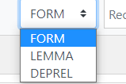
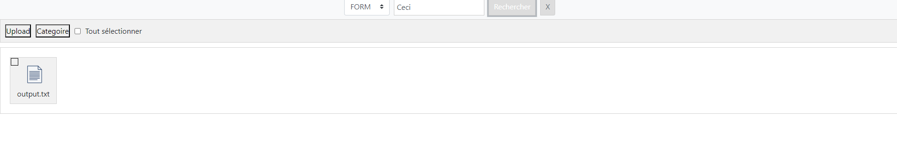
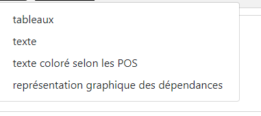

# Wang-Luo

## Introduction
Ce projet consiste à créer une plateforme de gestion des fichiers conllu en utilisant les langages SQL, PHP, HTML, JavaScript etc. Ce projet est composée de deux parties principales, l'une de permet l'utilisateur à se connecter à notre plateforme, l'autre permet d'éffectuer les fonctions telles que filtrer, trier etc.

## Lien
http://i3l.univ-grenoble-alpes.fr/~wang/ProjetWeb/  
Pour utiliser vous pouvez utilise "Login : admin , Mot de passe: admin" pour connexion.

## Les réalisations des algorithmes
Dans cette partie, on va présenter les structures des algorithmes à partir de deux aspects: la base de données et la réalisation des fonctions.

### La structure de base de données
Dans le cadre de base de données, il existe trois tables, table de _Login_, _Information_ et _datas_.
#### Table _Login_
Cette table est utilisé pour stocker les nom et mot de pass des utilisateurs lors de ses connextions. Il y a deux éléments: _nom_ et _mdp_, et en même temps, nom est la clé primaire ici.

| nom| type |
| ------ | ------ |
|   nom     |   varchar(20)     |
|   mdp     |  varchar(6)     |
#### Table _Information_
Cette table consiste à stocker les informations des fichiers telles l'année, la langue, les lables etc. On utilise cette table pour la fonction de classifier des fichiers. La strcuture de cette table comme ci-dessous.
| nom| type |annotation | 
| ------ | ------ |------ |
|Titre   | varchar(50)| le titre du fichier
|Année   | int(11)   | l'année du fichier "Entrée de l'utilisateur"
|Langue  |  varchar(100)| la langue utilisée du fichier "Entrée de     l'utilisateur"
|utilisateur| varchar(100)|le détenteur du fichier "Génération automatique"
|ID        | int(1)   | 1 pour oui "le fichier ayant cette information  ", 0 pour non "Génération automatique"
|FORM      | int(1)   | 1 pour oui , 0 pour non
|LEMMA     | int(1)   | 1 pour oui , 0 pour non
| UPOS     |  int(1)  | 1 pour oui , 0 pour non
| XPOS     | int(1)       |1 pour oui , 0 pour non
| FEATS    | int(1)       |1 pour oui , 0 pour non
| HEAD     | int(1)       |1 pour oui , 0 pour non
| DEPREL   |  int(1)      |1 pour oui , 0 pour non
| DEPS     |   int(1)     |1 pour oui , 0 pour non

#### Table _datas_
Dans ce cas, cette table s'agit de stocker les informations de conllu lors du téléchargement et la visualisation.

| nom | type |annotation| 
| ------ | ------ |------ |
|   MISC     |  int(100)      |
|   utilisateur  | varchar(20)       |
|   ID     |   varchar(100)     |
|   FORM     |  varchar(100)      |
|   LEMMA     |  varchar(100)      |
|   UPOS     |  varchar(100)      |
|   XPOS     |  varchar(100)      |
|   FEATS     |  varchar(100)      |
|   HEAD     |  varchar(100)      |
|  DEPREL      |  varchar(100)      |
|  DEPS      |  varchar(100)      |

### La structure de ce projet
#### connexion.php
Les fichiers nécessaires pour la connexion à une base de données.
#### create_user.php

Accepter le nom d'utilisateur et le mot de passe de "créer un nouveau compte" dans index.php et les soumettre à la base de données de connexion SQL.
#### delete.php
Le fichier pour implémenter la fonction de suppression consiste à recevoir le nom de fichier et le nom d'utilisateur envoyés depuis dossier.php, trouver les données correspondantes dans la base de données Information, puis les supprimer.
#### dossier.php
Le code principal de la page web, avec toutes les logiques déclenchées dans l'interface du fichier et la conception de la page web (Attention( Ꙭ), il y a plus de 1200 lignes de code).
#### download_file_text.php
Pour implémenter la fonction de téléchargement de texte, la logique consiste à recevoir le nom d'utilisateur et le nom de fichier envoyés depuis dossier.php, trouver les données correspondantes dans la base de données datas, extraire le formulaire et l'envoyer à dossier.php. Ensuite, dossier.php crée un élément téléchargeable pour que l'utilisateur puisse le télécharger.
#### download_file.php
Pour implémenter la fonction de téléchargement, la logique consiste à recevoir le nom d'utilisateur et le nom de fichier envoyés depuis dossier.php, trouver les données correspondantes dans la base de données datas, extraire les données Conll et les envoyer à dossier.php. Ensuite, dossier.php crée un élément téléchargeable pour permettre à l'utilisateur de télécharger les données.
#### file_list.php

Mise à jour en temps réel de la liste des fichiers de l'utilisateur. La logique consiste à recevoir le nom d'utilisateur envoyé depuis dossier.php, puis trouver les titres correspondants dans la base de données Information et les envoyer à dossier.php.
#### get_file_info.php
Affichage des informations telles que l'année de création du fichier, la langue et les annotations disponibles. La logique consiste à recevoir le nom d'utilisateur et le nom de fichier envoyés depuis dossier.php, puis trouver les données correspondantes dans la base de données Information et les envoyer à dossier.php.
#### get_files_by_conll.php
Pour trier les fichiers par annotation disponible, la logique de base consiste à recevoir le nom d'utilisateur et le nom de fichier envoyés depuis dossier.php, puis trouver les données correspondantes dans la base de données Information. Ensuite, vérifier si l'annotation Conll existe dans les données et envoyer la liste des résultats à dossier.php.
#### get_files_by_langue.php，get_files_by_year_Desc.php，get_files_by_year.php
Pour trier les fichiers par année de création et langue, la logique de base consiste à recevoir le nom d'utilisateur et le nom de fichier envoyés depuis dossier.php, puis trouver les données correspondantes dans la base de données Information. Ensuite, trier les données selon l'année de création et la langue, et envoyer la liste des résultats triés à dossier.php.
#### index.php
La mise en œuvre principale de l'interface de connexion.
#### login.php
Implémentation de la fonction de connexion. La logique consiste à vérifier si les données envoyées depuis index.php (nom d'utilisateur et mot de passe) correspondent à celles dans la base de données Login. Si les données correspondent, l'utilisateur est redirigé vers dossier.php.
#### open_relation.php，open_table.php，open_text_color.php，open_text.php
Pour implémenter la fonction d'ouverture de fichier, en fonction de la méthode d'ouverture sélectionnée, la logique consiste à recevoir les données (nom d'utilisateur et nom de fichier) envoyées depuis dossier.php, puis trouver les données correspondantes dans la base de données datas et les envoyer à dossier.php.
#### reset_password.php
Pour implémenter la fonction de réinitialisation de mot de passe, la logique consiste à recevoir le nom d'utilisateur et le nouveau mot de passe envoyés depuis index.php, puis trouver le nom d'utilisateur correspondant dans la base de données Login et modifier le mot de passe.
#### search_titles.php
Pour implémenter la fonction de recherche de fichiers, la logique consiste à trouver les données correspondantes dans la base de données datas en fonction des termes de recherche et du type de recherche saisis par l'utilisateur, puis envoyer les noms de fichiers correspondants à dossier.php.
#### upload_file.php

Pour implémenter la fonction d'envoi de fichiers, la logique consiste à convertir le fichier téléchargé par l'utilisateur en données de chaîne de caractères, puis à ajouter les données dans la base de données datas correspondante en utilisant le nom d'utilisateur et le nom de fichier fournis.
#### upload_information.php
Pour implémenter la fonction d'ajout d'informations supplémentaires lors de l'envoi de fichiers (année de création, langue), la logique consiste à recevoir les données envoyées depuis dossier.php, puis à ajouter ces données dans la base de données Information correspondante.
## Guide d'utilisation
En tant que une plateforme de gestion des fichiers en format conllu, cela nou permet d'effectuer des tâches essentiles par ses 9 fonrtions: _rechercher_, _poster_, _classifier_,_sélectionner tout_, _télécharger sous format conllu_, _télécharger sous format txt_, _supprimer un ou plusieurs_, _ouvrir le fichier (peut réaliser sous 4 formats)_ et _consulter les informations du fichier_. 
1. **Rechercher** 
L'utilisateur peut entrer les choses qu'il veut chercher dans la barre de recherche.  
 
Et il est capable de faire des recherches par FORM, LEMMA et DEPREL. 
 
Lors de cliquer le button _Rechercher_, les résultats s'affichent. 
 
Si l'utilisateur veut faire une nouvelle recherche, il faut cliquer _×_ dans la barre de recherche. 

2. **Poster** 
Pour poster un fichier, il faut cliquer le button Upload. Cependant il exige le format conll avec extension _.txt_ pour le fichier. 
Il demande également l'utilisateur de fournir des informations supplémentaires concernant le fichier telle que Année et Langue. Dès que tout est rempli, l'utilisateur peut cliquer le button _Soumettre_ pour le finaliser.  

3. **Classifier** 
Ce système permet l'utilisateur de classifier ses fichiers selon l'année, la langue et les lables().

4. **Sélectionner** 
Cela permet l'utilisateur de sélectionner tous ses fichiers.

5. **Télécharger sous format conllu** 
L'utilisateur peut télécharger un fichier sous format conllu en le choisissant et crochant.

6. **Télécharger sous format txt** 
L'utilisateur peut télécharger un fichier sous format txt en le choisissant et crochant.

7. **Supprimer un ou plusieurs** 
Cette fonction permet de supprimer un ou plusieurs fichiers en les choisissant et crochant.

8. **Ouvrir le fichier (visualiser sous 4 formats)**
L'utilisateur peut ouvrir et visualier le fichier choisi sous 4 formats:
_tableaux_, _texte_, _texte coloré selon les POS_ et _représentation graphique des dépendances_. 
 
Dans le cas de texte coloré selon les POS, les couleurs correspondent avec les catégories comme le tableau ci-dessous:

| header | header |
| ------ | ------ |
|  ADJ      |  red  `#FF0000`     |
|   _ADP_     | green `#00FF00`      |
|  ADV      |  blue `#0000FF`      |
|  AUX      |  yellow `#FFFF00`     |
|  CCONJ      | purple `#800080`      |
|  DET      | orange `#FFA500`      |
|  INTJ      | Navy Blue `#000080`     |
|   NOUN     |  Light Gray `#D3D3D3 `   |
|  NUM      | Gray `#808080`     |
|  PART      | Brown  `#A52A2A `    |
|  PRON      | Pink  `#FFC0CB`      |
|  PROPN      |  Turquoise `#40E0D0`     |
|  PUNCT      |  Gold  `#FFD700`    |
|  SCONJ      |  Silver `#C0C0C0 ` |
|  SYM      |  SteelBlue `#4682B4`  |
|  VERB      |  Teal  `#008080`    |
|   X     |  Maroon  `#800000`     |
|   default     | black`#000000 `     |

9. **Consulter les informations du fichier**
Cela permet l'utilisateur de consulter les informations du fichier choisi telles que l'année, la langue etc. Il faut choisir le fichier et cliquer le button _consulter_.

## Les bogues
1. Il est incapable de faire les recheches sur les résultats classifiés des fichiers. On n'arrive pas à le réaliser à ce moment-là. 

2. Il apparaît quelquefois des bogues des buttons quand l'utilisateur fait des manipulations. Par exemple, quand l'utilisateur veut supprimer un fichier, les button supprimer et ouvrir sont tout dans le barre, il faut cliquer rélféchir ou ce fichier pour revenir à la norme.

3. Étant donné que l'on utilise un transfert et un traitement par chaîne (qui n'envoie pas le fichier au serveur) plutôt que d'envoyer le fichier au serveur pour un traitement ultérieur, les utilisateurs ne peuvent pas télécharger des fichiers trop volumineux.  

4. Les trois bases de données ne sont pas connectées.

